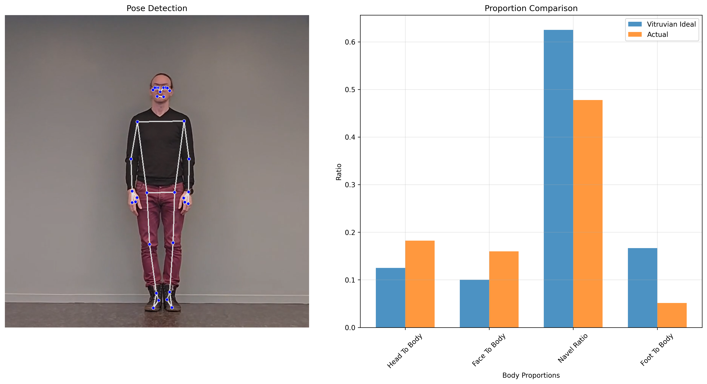

# Vitruvian Proportion Analyzer

A Python tool that analyzes human body proportions against the classical Vitruvian ideal using computer vision and pose estimation.

## Overview

This project uses MediaPipe's pose estimation to detect human body landmarks and compare them against the classical proportions described by Vitruvius and famously illustrated by Leonardo da Vinci. The tool provides both numerical analysis and visual comparisons of body proportions.



## Features

- **Automated Pose Detection**: Uses MediaPipe for human pose landmark detection
- **Vitruvian Proportion Analysis**: Compares detected proportions against classical ideals
- **Visual Analysis**: Generates comparison charts and annotated pose visualizations
- **Detailed Reporting**: Provides percentage deviations from ideal proportions

## Classical Proportions Analyzed

The tool analyzes four key Vitruvian proportions:

1. **Head to Body Ratio**: Head height should be 1/8 of total height
2. **Face to Body Ratio**: Face height should be 1/10 of total height  
3. **Navel Ratio**: Navel should be positioned 5/8 from the feet
4. **Foot to Body Ratio**: Foot length should be 1/6 of total height


## Usage

### Quick Start with Any Image

```bash
# Analyze any image with automatic output naming
python vitruvius_measurement.py --image your_photo.jpg --auto-output

# Just get a quick summary
python vitruvius_measurement.py --image your_photo.jpg --summary-only

# Custom output paths
python vitruvius_measurement.py --image your_photo.jpg --output my_analysis.png --save-data my_data.json
```

### Command Line Options

```bash
# List supported image formats
python vitruvius_measurement.py --list-formats

# Adjust detection confidence (0.0-1.0)
python vitruvius_measurement.py --image photo.jpg --confidence 0.7

# Batch processing (no display)
python vitruvius_measurement.py --image photo.jpg --no-display --auto-output
```

### Programmatic Usage

```python
from vitruvius_measurement import analyze_image, VitruvianAnalyzer

# Simple one-line analysis
results = analyze_image("your_photo.jpg")

# With custom settings
results = analyze_image(
    image_path="photo.jpg",
    output_path="analysis.png", 
    save_data="data.json",
    confidence=0.7
)

# Advanced usage
analyzer = VitruvianAnalyzer()
results = analyzer.analyze_proportions("photo.jpg")
summary = analyzer.get_analysis_summary(results)
```

### Basic Usage

```python
from vitruvius_measurement import VitruvianAnalyzer

# Initialize the analyzer
analyzer = VitruvianAnalyzer()

# Analyze an image
results = analyzer.analyze_proportions("your_image.jpg")

# Print results
analyzer.print_analysis(results)

# Create visualization
analyzer.visualize_analysis("your_image.jpg", results, "output.png")
```

## Input Requirements

For best results, your input image should:

- Contain a single person in full view
- Show the person standing upright
- Have good lighting and contrast
- Be taken from the front or back
- Show the person without heavy clothing that obscures body shape
- Include the full body from head to feet

## Output

The tool provides three types of output:

1. **Console Analysis**: Detailed numerical comparison with percentage deviations
2. **Visualization Image**: Side-by-side pose detection and proportion comparison chart
3. **Analysis Data**: Structured data dictionary with all measurements and calculations

## Dependencies

- `opencv-python`: Image processing and loading
- `mediapipe`: Human pose estimation
- `numpy`: Numerical computations
- `matplotlib`: Visualization and plotting

## License

This project is open source and available under the [MIT License](LICENSE).

## Acknowledgments

- Based on the classical proportions described by Vitruvius
- Uses Google's MediaPipe for pose estimation
- Inspired by Leonardo da Vinci's Vitruvian Man
- Lots of help from CoPilot in writing the code and documentaiton